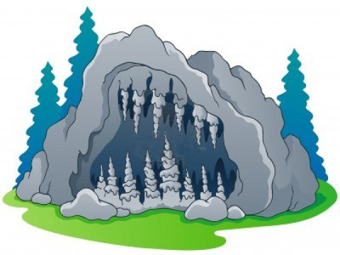

Underground Ventures
====================

Underground Ventures est un jeu de cartes sur le thème de la construction et de l'exploration de donjons.



Avec leurs cartes, les joueurs construisent ensemble les niveaux successifs de plusieurs donjons,
y disséminant trésors, pièges, et monstres

En parallèle, ils incarnent des aventuriers qui partent explorer ces mêmes donjons
pour tenter d'y récolter un maximum de richesses.

Règles du jeu
-------------

Les règles du jeu (en développement) sont disponibles en ligne en suivant ce lien :
[`./rules/src/main/asciidoc/Underground Ventures`](./rules/src/main/asciidoc/Underground%20Ventures.adoc).

Print-n-Play
------------

Il n'existe à l'heure actuelle pas de fichier permettant de directement confectionner
soi-même un exemplaire du jeu.
(Mais ce repository contient toutes les informations nécessaires pour fabriquer l'intégralité du matériel nécessaire.)

Informations techniques
-----------------------

### Règles

Il est possible de générer une version transportable (HTML ou PDF) du livret de règles en suivant ces instructions :

**Prérequis:**

- [Maven](http://maven.apache.org/)
    - dernière version testée : Maven 3.5.4
    - (mais des versions plus anciennes devraient fonctionner également)

- Et donc aussi un [JDK](http://jdk.java.net/)
    - n'importe quelle version >= 1.7 peut faire l'affaire
    - (les versions >= 9 provoquent des warnings)

**Instructions:**

```sh
git clone https://github.com/arnauldvm/bg-underground.git
cd bg-underground/rules
mvn -Pbackend-html
mvn -Pbackend-pdf
```

Ces commandes génèreront dans le répertoire `./target/generated-docs` un fichier `Underground Ventures.html` et un fichier `Underground Ventures.pdf` qui reprennent chacun l'ensemble des règles. (Les autres fichiers sont des extraits, de chapitres et sous-chapitres.)

### Génération des cartes

Les cartes sont générées au moyen du logiciel nanDECK ([www.nand.it/nandeck](http://www.nand.it/nandeck/)) (dernière version testée 1.18.6).

Tous les fichiers nécessaires se trouvent dans le répertoire [`cards/`](./cards/) :

- Le fichier de définition de toutes les cartes [`all_cards.nde`](./cards/all_cards.nde),
- qui se base sur les paramètres dans le fichier [`all_cards.csv`](./cards/all_cards.csv).
